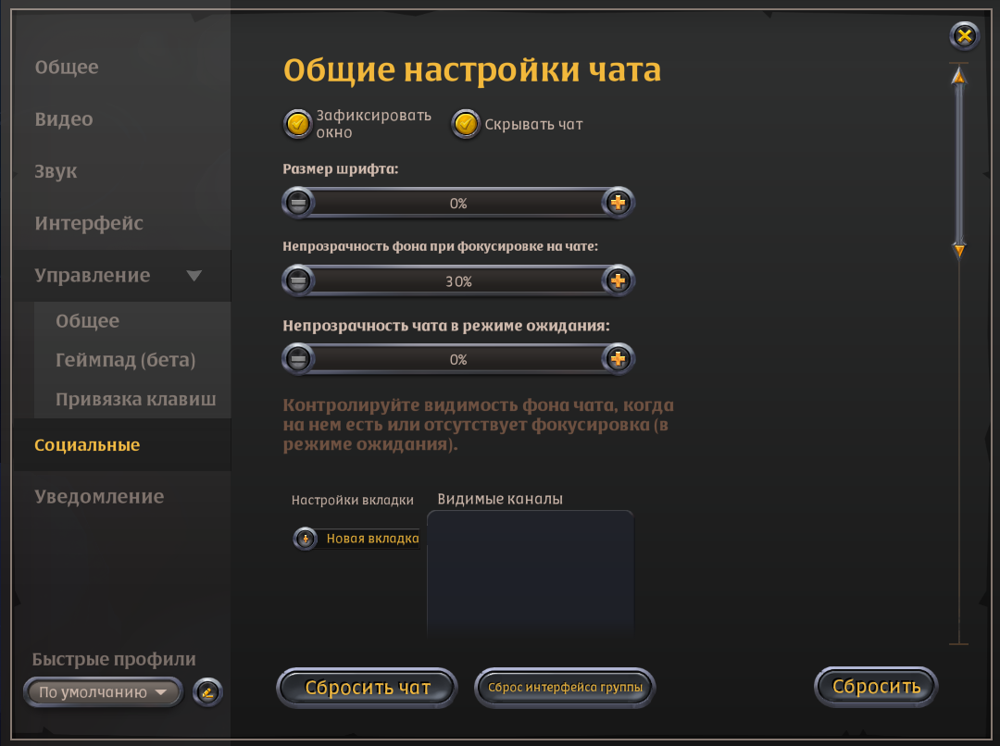

# [User Agreement](https://github.com/CodeRaid3rs/User-Agreement)

## Documentation for **CodeRaiders Albion Fishing Bot (Lite)**  
[**Project Information**](https://t.me/CodeRaidersInformation)  

---

### **Description**  
**CodeRaiders Albion Fishing Bot (Lite)** is a tool for automating fishing in Albion Online. It simplifies the fishing process, offering an intuitive interface and flexible configurations for users.

---

### **System Requirements**  
- **Windows 10**: versions 1909–22H2  
- **Windows 11**: version 21H2 or later  
- Supported screen resolution: **1920 x 1080**

---

### **Preparation Before Launch**

#### **1. Disable Antivirus Software**  
Antivirus programs may block the bot, causing errors or making it non-functional. Ensure your antivirus is turned off while using the bot.

#### **2. Uninstall Anti-Cheat Software (Faceit and Vanguard)**  
Anti-cheat programs like Faceit or Vanguard may interfere with the bot's operation. Uninstall them and restart your computer.

#### **3. Configure Game Settings**  
Ensure your game settings match the recommendations below to ensure stable bot performance.

  
  
  
  
  
  

---

### **Game Settings**  
**Important! Set the game interface to Russian language.**

- **Video Tab**: Configure graphics settings as shown above (include screenshots if needed).  
- **Interface**: Ensure interface settings meet the requirements.  
- **Social Features**: Disable unnecessary functions to improve stability.  

---

### **Tab Functions**

#### **"Bot Control" Tab**  
- **Start Bot** – starts automated fishing.  
- **Stop Bot** – stops the bot.  
- **Set Cord** – sets up to three coordinates for casting the fishing rod.  
- **Start Helper** – activates the helper for automatic hooking when casting manually.  
- **Stop Helper** – deactivates the helper.

#### **"Configuration" Tab**  
- **Save Config** – saves current settings.  
- **Load Config** – loads previously saved settings.  
- **Reset To Default** – resets settings to default values.  

#### **"Options" Tab**  
- **Worms** – automatically uses Tier 3 or 5 worms every 10 fish.  
- **Pie** – automatically applies Tier 5 pies every 30 minutes.  
- **Auto Trash Remover** – clears unnecessary items from inventory every 30 fish.  
- **Auto Reconnect** – reconnects to the server after disconnections.  
- **Character Selection** – specifies the character for reconnecting.  
- **Stats** – displays statistics.  
- **Damage Notifications** – sends Telegram notifications about received damage.

#### **"Binds" Tab**  
- **Menu** – toggles menu visibility.  
- **Fix Square** – locks fishing coordinates.  
- **Start Bot** – starts fishing.  
- **Stop Bot** – stops the bot.  

#### **"Notifications" Tab**  
- Configure Telegram notifications:  
  - **Telegram UserID**  
  - **Telegram Bot_Token**

#### **"Radar" Tab**  
- **Enable Radar** – activates radar to display fishing spots:  
  - **5 Fish** – shows spots with 5 fish.  
  - **1 Fish** – shows spots with 1 fish.  
  - **Don't Show Empty Spots** – hides empty spots.  
  - **Haze** – displays mist levels: Normal, Strange, Rare, Legendary, Epic.

---

### **How to Launch the Bot Correctly**

#### **1. Choose a Fishing Location**  
Go to the desired fishing spot on the map.  

#### **2. Set Casting Coordinates**  
- Click **Set Cord**.  
- Hover the cursor over the desired screen area and press the hotkey (default: **F3**).  
- Set up to three squares. The bot will cast randomly within these squares.  

#### **3. Adjust Parameters**  
- In the **Settings** tab, activate options like automatic bait or pie usage if needed.  

#### **4. Start the Bot**  
- Hide the menu using the **Menu** hotkey.  
- Start the bot with the hotkey (default: **F1**).  

#### **5. Save Your Settings**  
Use the **Save Config** button to save your configuration for future use.

---

Follow these steps and enjoy automated fishing in Albion Online with **CodeRaiders Albion Fishing Bot (Lite)**!

---

# [Пользовательское соглашение](https://github.com/CodeRaid3rs/User-Agreement)

## Документация к **CodeRaiders Albion Fishing Bot (Lite)**  
[**Информация проекта**](https://t.me/CodeRaidersInformation)  

---

### **Описание**  
**CodeRaiders Albion Fishing Bot (Lite)** – это инструмент для автоматизации рыбалки в игре Albion Online. Он упрощает процесс ловли рыбы, предлагая удобный интерфейс и гибкие настройки для каждого пользователя.

---

### **Системные требования**  
- **Windows 10**: версии 1909–22H2  
- **Windows 11**: версии 21H2 и выше  
- Поддерживаемое разрешение экрана: **1920 x 1080**

---

### **Подготовка перед запуском**

#### **1. Отключите антивирус**  
Антивирусные программы могут блокировать работу бота, вызывая ошибки или полную неработоспособность. Убедитесь, что антивирус отключён во время использования бота.

#### **2. Удалите античиты Faceit и Vanguard**  
Античиты, такие как Faceit и Vanguard, могут мешать корректной работе бота. Удалите их, а затем перезагрузите компьютер.

#### **3. Настройте параметры игры**  
Убедитесь, что настройки игры соответствуют приведённым ниже рекомендациям, чтобы обеспечить стабильную работу бота.

  
  
  
  
  
  

---

### **Настройки игры**  
**Важно! Переведите интерфейс игры на русский язык.**

- **Вкладка "Видео"**: настройте графические параметры согласно рекомендациям (при необходимости вставьте скриншоты).  
- **Интерфейс**: убедитесь, что настройки соответствуют требованиям.  
- **Социальные функции**: отключите ненужные элементы для стабильной работы.  

---

### **Функционал вкладок**

#### **Вкладка "Bot Control"**  
- **Start Bot** – запуск автоматической рыбалки.  
- **Stop Bot** – остановка работы бота.  
- **Set Cord** – установка до трёх координат для заброса удочки.  
- **Start Helper** – включение помощника для автоматической подсечки рыбы при ручном забросе.  
- **Stop Helper** – отключение помощника.

#### **Вкладка "Configuration"**  
- **Save Config** – сохранение текущих настроек.  
- **Load Config** – загрузка ранее сохранённых настроек.  
- **Reset To Default** – сброс настроек до стандартных.  

#### **Вкладка "Options"**  
- **Worms** – автоматически использует червей 3-го или 5-го тира каждые 10 рыб.  
- **Pie** – автоматически применяет пироги 5-го тира каждые 30 минут.  
- **Auto Trash Remover** – удаляет ненужные предметы из инвентаря каждые 30 рыб.  
- **Auto Reconnect** – автоматически переподключается после разрыва соединения.  
- **Выбор персонажа** – указывает персонажа для переподключения.  
- **Stats** – отображает статистику.  
- **Damage Notifications** – отправляет уведомления о полученном уроне в Telegram.

#### **Вкладка "Binds"**  
- **Menu** – управление отображением окна меню.  
- **Fix Square** – фиксация координат для заброса.  
- **Start Bot** – запуск процесса рыбалки.  
- **Stop Bot** – завершение работы бота.  

#### **Вкладка "Notifications"**  
- Настройка Telegram для уведомлений:  
  - **Telegram UserID**  
  - **Telegram Bot_Token**

#### **Вкладка "Radar"**  
- **Enable Radar** – активация радара для отображения рыболовных точек:  
  - **5 Fish** – отображает точки с 5 рыбами.  
  - **1 Fish** – отображает точки с 1 рыбой.  
  - **Don't Show Empty Spots** – скрывает пустые места.  
  - **Haze** – отображает уровни мглы: Normal, Strange, Rare, Legendary, Epic.

---

### **Как правильно запустить бота?**

#### **1. Выберите место для рыбалки**  
Подойдите к нужной точке на карте.  

#### **2. Установите координаты заброса**  
- Нажмите **Set Cord**.  
- Наведите курсор на нужную область экрана и нажмите горячую клавишу (по умолчанию **F3**).  
- Установите до трёх квадратов. Бот будет забрасывать удочку в случайный из них.  

#### **3. Настройте параметры**  
- В разделе **Settings** активируйте автоматическое использование червей и пирогов, если это необходимо.  

#### **4. Запустите бота**  
- Скрыть меню можно горячей клавишей **Menu**.  
- Запустите бота с помощью горячей клавиши (по умолчанию **F1**).  

#### **5. Сохраните настройки**  
Сохраните конфигурацию через **Save Config**, чтобы в будущем не перенастраивать параметры.

---

Следуйте этим рекомендациям и наслаждайтесь автоматизированной рыбалкой в Albion Online с **CodeRaiders Albion Fishing Bot (Lite)**!
